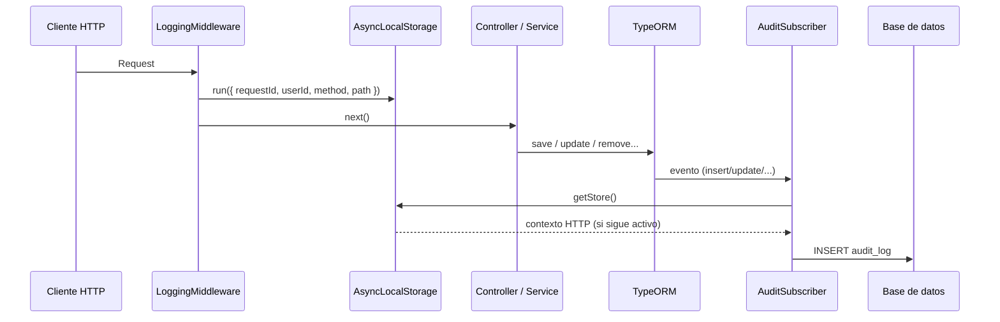

# Documentación del sistema de auditoría

## En pocas palabras

La auditoría **no** se dispara desde decoradores en cada controlador ni desde interceptors HTTP. Lo que hace es **escuchar los eventos de TypeORM** cuando el ORM persiste cambios en la base de datos. Por cada inserción, actualización o borrado (incluido soft delete y restore), el `AuditSubscriber` arma un registro con **quién** pudo identificarse, **qué entidad** cambió, **antes y después** (JSON) y **en qué petición HTTP** ocurrió (si hay contexto).

Si entiendes solo esto, ya tienes el modelo mental correcto: **HTTP → contexto por request → código de negocio guarda con TypeORM → TypeORM avisa al subscriber → se inserta una fila en `audit_log`**.

---

## Qué componentes intervienen (y dónde están)

| Pieza | Archivo | Rol |
|--------|---------|-----|
| Contexto por request | `src/schematics/audit/config/request-context.ts` | `AsyncLocalStorage`: guarda `requestId`, `userId`, `method`, `path` para todo el async tree de esa petición. |
| Quién rellena ese contexto | `src/middlewares/log-middleware.ts` | Al entrar la request: genera o reutiliza `x-request-id`, resuelve `userId` con `resolveAuditUserId`, y ejecuta `RequestContext.run(store, () => next())`. |
| Motor de auditoría | `src/schematics/audit/config/audit.subscriber.ts` | Subscriber de TypeORM: en cada evento ORM elegible construye `beforeJson`/`afterJson` y hace `insert` en `AuditLog`. |
| Registro global del subscriber | `src/config/typeorm/data-source-local.ts` | `subscribers: [AuditSubscriber]` — sin esto, TypeORM no invoca el subscriber. |
| Activación del middleware | `src/app.module.ts` | `LoggingMiddleware` aplicado a `'*'` — sin esto, `getRequestContext()` suele devolver `undefined` y pierdes correlación HTTP. |
| Utilidades | `src/schematics/audit/config/audit.utils.ts` | `toPlainForAudit`, comparación de snapshots, `resolveAuditUserId` (usado en el middleware). |

**Importante:** los interceptors de auditoría manual (`AuditInterceptor`, `AuditHttpInterceptor`) **ya no existen** en esta plantilla. Toda la traza relevante va por el subscriber + contexto HTTP.

---

## Por qué hace falta `AsyncLocalStorage` (RequestContext)

El `AuditSubscriber` **no recibe** el objeto `Request` de Express. TypeORM llama al subscriber desde su propia pila asíncrona. `AsyncLocalStorage` es el mecanismo de Node para **propagar un “bolsillo” de datos** por toda la cadena asíncrona que arrancó dentro de `RequestContext.run(...)`.

Eso permite que, cuando el subscriber escribe el log, pueda leer:

- `requestId` — correlación (cabecera `x-request-id` o UUID generado).
- `userId` — si el middleware pudo resolverlo desde `request.user` o del JWT en `Authorization`.
- `method` y `path` — para saber en qué endpoint ocurrió el cambio.

Si algo del flujo **sale** del store (por ejemplo un job en cola sin `run`, o un script CLI), `getRequestContext()` puede ser `undefined`: en ese caso `method`/`path`/`requestId` pueden quedar vacíos y el `userId` solo se infiere por las reglas del subscriber (ver más abajo).

---

## Orden real de ejecución en una petición típica

1. Llega el HTTP request.
2. **`LoggingMiddleware`**: crea el store y hace `RequestContext.run(store, () => next())`.
3. Nest ejecuta **guards**, **pipes**, **controller**, **servicios**.
4. El servicio llama a **TypeORM** (`save`, `update`, `remove`, `softRemove`, `recover`, etc.).
5. TypeORM emite el evento correspondiente y ejecuta **`AuditSubscriber`**.
6. El subscriber serializa entidad con **`toPlainForAudit`** (respeta `@AuditExclude`), compara si hace falta, y **`insert`** en la tabla de logs.



---

## Cómo se mapean los eventos de TypeORM a `action` y a `before`/`after`

| Evento TypeORM | Momento | `action` | `beforeJson` | `afterJson` |
|----------------|---------|----------|--------------|-------------|
| `afterInsert` | Tras insertar | `CREATE` | `null` | entidad nueva (plana) |
| `beforeUpdate` | Antes de actualizar | `UPDATE` | fila anterior (`databaseEntity`) | entidad con cambios |
| `beforeRemove` | Antes de borrar duro | `DELETE` | fila que se borra | `null` |
| `beforeSoftRemove` | Antes de soft delete | `SOFT_DELETE` | fila antes | `null` |
| `beforeRecover` | Antes de restaurar | `RESTORE` | `null` | entidad recuperada |

La serialización pasa por **`toPlainForAudit`**: se excluyen propiedades con `@AuditExclude`, y las relaciones se reducen para evitar JSON enormes o ciclos.

---

## Regla anti-ruido en `UPDATE`

Si después de aplicar exclusiones los snapshots **`beforeJson` y `afterJson` son equivalentes** (comparación estable con `areAuditSnapshotsEqual`), **no se inserta** fila de auditoría. Sirve para no llenar la tabla cuando el “cambio” no es visible (o solo tocaba campos excluidos).

---

## Cómo se resuelve `userId` (quién hizo el cambio)

1. **Desde el contexto HTTP** (`getRequestContext()?.userId`): el middleware lo calcula con **`resolveAuditUserId(request)`** — primero `request.user` (tras guards), si no, verificación del Bearer con `JWT_SECRET` o `ACCESS_TOKEN_SECRET` (misma idea que el guard flexible).
2. **Fallback si la entidad es `Usuario`**: si el contexto no trae usuario pero estás auditando la fila de un usuario, se usa el **`id` de esa fila** como actor (útil cuando AsyncLocalStorage no está disponible en un tramo del ciclo de TypeORM).
3. Si no hay forma de saberlo: **`userId = 0`**.

Por eso en **signup público** puede verse `userId` igual al id del usuario recién creado en logs de `Usuario`: el token aún no está en el mismo formato que el middleware espera, pero el fallback por entidad cubre el caso.

---

## `requestId`: UUID, no clave de negocio

`requestId` **no** es el `id` de una tabla de aplicación. Es un identificador de **correlación**: todas las escrituras ORM que ocurran en la misma petición HTTP comparten el mismo `requestId` (mientras el contexto ALS siga asociado). Sirve para enlazar varias filas de `audit_log` con **una** request en logs o trazas.

---

## Duplicados en `afterInsert`

El subscriber marca la entidad con `_auditProcessed` tras auditar un insert para **evitar dobles ejecuciones** en escenarios donde TypeORM podría disparar el flujo más de una vez para la misma entidad.

---

## Qué entidades se auditan

- **Por defecto:** cualquier entidad registrada en TypeORM **se audita**, salvo que lleve **`@AuditExcludeEntity()`** en la clase (metadata `true` en `AUDIT_EXCLUDE`).
- **`@AuditExclude()`** en propiedades **no** desactiva la entidad: solo **oculta campos** en el JSON (p. ej. contraseñas).

Caso habitual: la propia entidad **`AuditLog`** va con `@AuditExcludeEntity()` para no auditar la tabla de auditoría (recursión).

---

## Registro del subscriber (obligatorio)

Archivo: `src/config/typeorm/data-source-local.ts`

```ts
subscribers: [AuditSubscriber]
```

Sin esta línea, los cambios en BD **no** generan logs.

---

## Exclusiones de auditoría

### Excluir campos sensibles

`@AuditExclude()` en la propiedad.

### Excluir entidad completa

`@AuditExcludeEntity()` en la clase — típico en `AuditLog`.

---

## Consulta de logs: `GET /audit`

Controlador: `src/schematics/audit/audit.controller.ts`

Los parámetros vienen de `SearchAuditLogDto` + `BaseSearchDto` (paginación, `q`, `orderBy`, etc.). El controlador usa `plainToInstance` para que métodos como `getOffset()` existan en el repositorio.

### Seguridad

Revisa el estado de los guards en el controlador. Si `@UseGuards(FlexibleJwtAuthGuard)` está comentado, el listado de auditoría es **público**. En producción suele exigirse JWT y, a menudo, rol administrador.

---

## Parámetros de búsqueda soportados

Incluyen entre otros: `id`, `userId`, `action`, `entity`, `entityId`, `method`, `path`, `requestId`, `q`, `pageNumber`, `pageSize`, `orderBy`, `orderDirection`, `groupBy`.

---

## Ejemplos de consulta

```http
GET /audit
GET /audit?userId=1
GET /audit?action=UPDATE
GET /audit?entity=Usuario&entityId=10
GET /audit?q=signup&pageNumber=1&pageSize=20
GET /audit?orderBy=id&orderDirection=DESC
GET /audit?groupBy=entity,action
```

---

## Ejemplo de registro

```json
{
  "id": 12,
  "userId": 1,
  "action": "UPDATE",
  "entity": "Usuario",
  "entityId": 1,
  "beforeJson": { "id": 1, "email": "old@mail.com" },
  "afterJson": { "id": 1, "email": "new@mail.com" },
  "method": "POST",
  "path": "/auth/signup",
  "requestId": "f45ef05b-df43-466c-9255-cf82c570274a"
}
```

---

## Troubleshooting rápido

### `request.getOffset is not a function` en `GET /audit`

Causa: el query llega como objeto plano. Solución: `plainToInstance(SearchAuditLogDto, ...)` en el controlador (ya aplicada).

### Error MySQL: `user_id doesn't have a default value`

Solución aplicada: insert mediante entidad `AuditLog` y mapeo de columnas, no SQL crudo que omita `user_id`.

### “No veo” algunos `UPDATE`

- Puede ser la regla anti-ruido (sin diff visible tras exclusiones).
- O el cambio real solo en campos con `@AuditExclude()`.

### `method` / `path` / `requestId` vacíos

Suele indicar que **no había** `RequestContext` activo (p. ej. tarea fuera del middleware, script, o flujo que no pasó por `RequestContext.run`).

---

## Checklist rápido

- [ ] `AuditSubscriber` en `subscribers` de TypeORM (`data-source-local.ts`).
- [ ] `LoggingMiddleware` registrado en `AppModule` para las rutas que quieras correlacionar.
- [ ] Campos sensibles con `@AuditExclude()`.
- [ ] `AuditLog` con `@AuditExcludeEntity()`.
- [ ] Política de acceso a `GET /audit` acorde al entorno.
